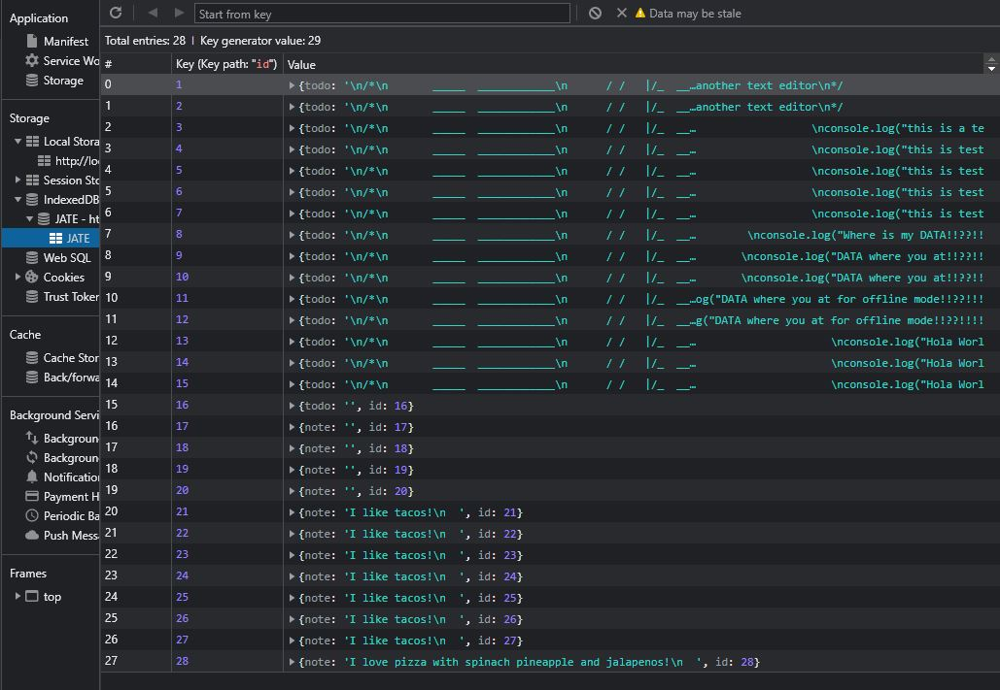

# textEditor
## Description
This is a progressive web application 

## Table of Contents

* [Installation](#Installation)
* [Usage](#Usage)
* [Tech](#Tech)
* [Links](#Links)
* [Demo](#Demo)
* [Contact](#Contact-me)

## Installation
Once cloning the repo, run npm i in the command line to install the necessary packages in the client file and run npm start/.
Then run npm i in the server file and run the server.
## Usage
Use the command line to invoke necessary packages. Then start the server. Once the server is running, open the browser and begin adding text. It will be saved in the IndexedDB JATE file in storage for later retrieval.

## Tech 
Express, Indexed DB, Javascript, Node,js, Webpack: Manifest and Service Worker
## Links
### Github
https://github.com/denisearevalo/textEditor.git
### Heroku
https://text-editor-4pwa.herokuapp.com/
## Demo

### Contact me
Please feel free to email me with any questions or create a pull request and I will get back to you as soon as I am able.
deniwonder8@gmail.com

#### Special Thanks
Chrissie, Heather and Nile for making this a fun assignment.

Kindly, Denise A